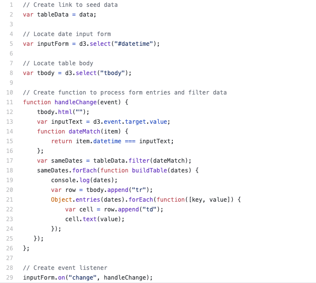
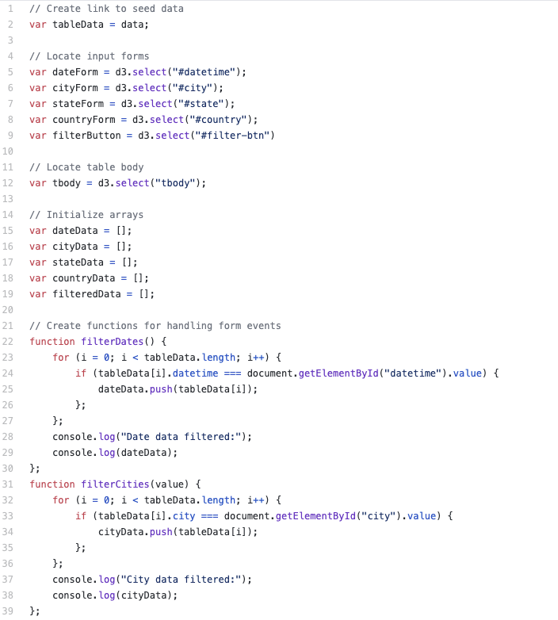
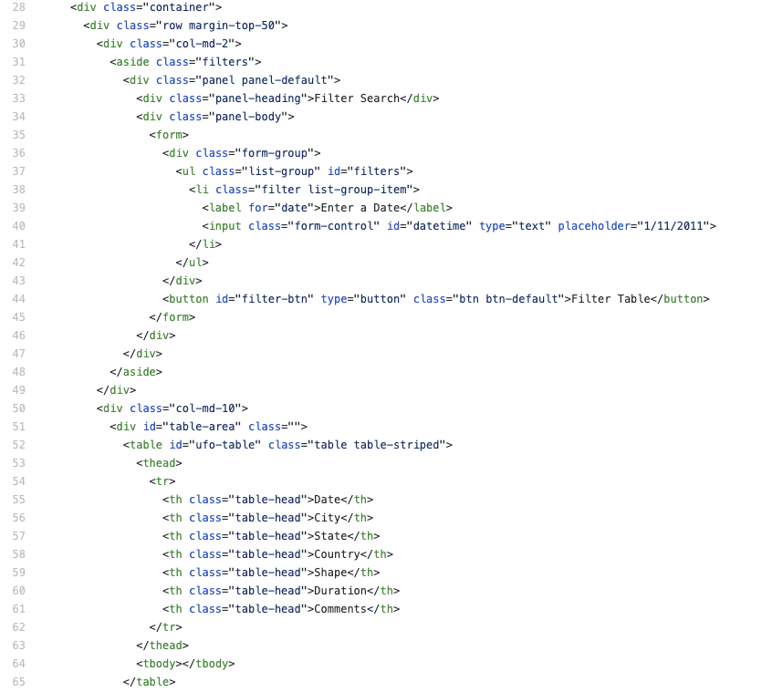
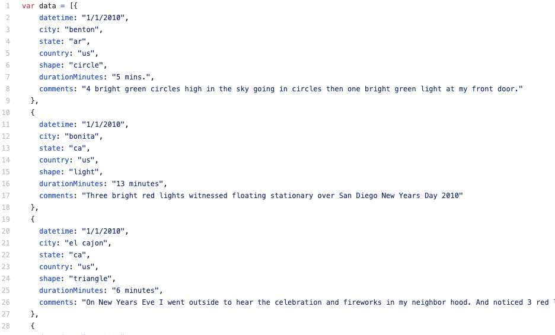

# JavaScript Challenge (Grade: A-)
 
### Table of Contents:

 1. [Project Goals](#project-goals)
 2. [Tools and Solutions](#tools-and-solutions)
 3. [Outcomes and Lessons Learned](#outcomes-and-lessons-learned)
 4. [App Screenshots](#app-screenshots)
 5. [Coding Screenshots](#coding-screenshots)

## Project Goals
With this project, I set out to master <a href="https://en.wikipedia.org/wiki/JavaScript">JavaScript</a>, a programming language that controls the client-side behavior of websites and web-based applicaitons. JavaScript is what makes individual sites and the <a href="https://en.wikipedia.org/wiki/World_Wide_Web">World Wide Web</a> interactive. I was provided with a dataset of UFO sightings for the assignment, and I was tasked with designing a new webpage, populating a dynamic table with the data, and creating interactive data-entry fields that allowed a user to perform searches and other table manipulations.

## Tools and Solutions
Most of this project's tasks focused on <a href="https://www.computerhope.com/jargon/e/event-listener.htm">event listening</a>, a category of interactions that take place between JavaScript and <a href="https://en.wikipedia.org/wiki/HTML">HTML</a>. Creating an event-listening function in connection with a particular HTML object allows JavaScript to execute upon the event's occurence. In the first part of the project, that event was the user's entry of a date. I <a href="https://github.com/sonder74/javascript-challenge/blob/master/UFO-level-1/static/js/app.js">programmed JavaScript</a> to use that entry as a filter on the table data, providing the user with table rows that matched his or her date. The bonus portion of the project required the simultaneous use of multiple user entries, in multiple HTML fields. I attempted to program <a href="https://github.com/sonder74/javascript-challenge/blob/master/UFO-level-2/static/js/app.js">a complex series of JavaScript conditionals</a> to handle these events, but unfortunately I was not able to successfully implement the code.

## Outcomes and Lessons Learned
Despite my difficulties with the project's bonus assignment, I had a great time learning the basics of JavaScript and attempting to apply them to a live website. I realized that JavaScript is what makes websites fun and useful, and I look forward to using it more routinely.

## App Screenshots

 

## Coding Screenshots

 
